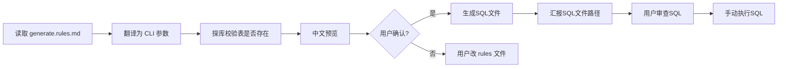
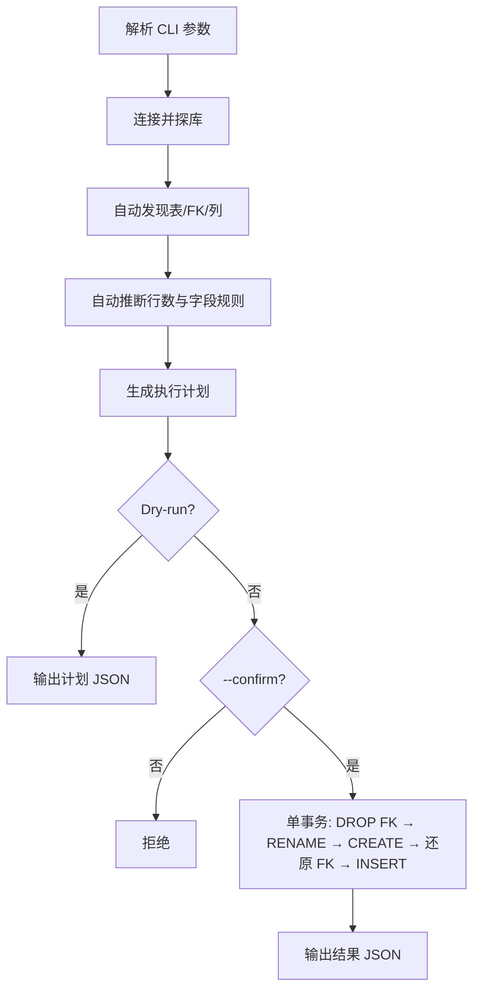

# 人大金仓 PG 模式 Skill Spec

> 本文档定义 kingbase-skill 的目标能力与接口规范。实现状态见各脚本与 [SKILL.md](../SKILL.md)。

## 背景

本 Skill 面向 KingbaseES **PostgreSQL 兼容模式**，提供两个能力：

| 能力 | 入参 | 出参 |
|------|------|------|
| **查询** | 数据库连接信息 + SQL | 查询结果（JSON） |
| **生成数据** | 连接 + 条数（+ 可选表名） | 生成SQL文件（不直接写入数据库） |

生成数据采用**零配置自动推断**：表关系与字段规则从数据库元数据读取，生成INSERT SQL语句文件，用户审查后手动执行。非技术人员只需对 Agent 说「每个表生成 100 条SQL」即可。

---

## 设计原则

1. **简单优先**：默认一条命令 / 一句自然语言即可生成SQL。
2. **自动推断一切**：表列表、外键关系、字段生成策略，全部从 `information_schema` / `pg_catalog` 读取。
3. **Agent 是翻译层**：Agent 探库 → 展示中文预览 → 确认 → 生成SQL文件。
4. **双脚本分离**：查询（`kingbase_query.py`）与生成（`kingbase_generate.py`）解耦。
5. **不直接写入数据库**：生成SQL文件供用户审查，确保数据安全。
6. **安全门槛**：必须 `--confirm`；先 `--dry-run` 展示计划。

---

## 能力一：查询数据（Query）

### 1.1 功能描述

执行只读 SQL，返回结构化 JSON 结果。

### 1.2 入参

**连接信息**（环境变量）：

| 变量 | 必填 | 说明 |
|------|------|------|
| `KB_USER` / `KB_PASSWORD` / `KB_DATABASE` | 是（或 URI） | 账号、密码、库名 |
| `KB_HOST` | 否 | 默认 `localhost` |
| `KB_PORT` | 否 | 默认 `54321` |
| `KB_URI` / `KINGBASE_URI` | 可选 | 替代分项变量 |
| `KB_SCHEMA` | 可选 | 连接后 `SET search_path` |
| `KB_MAX_ROWS` | 可选 | 默认 500 |
| `KB_DRIVER` | 可选 | `auto` / `ksycopg2` / `psycopg2` |

**CLI 参数**：

```bash
python3 scripts/kingbase_query.py --sql "SELECT * FROM users LIMIT 10" --max-rows 500
# 或
python3 scripts/kingbase_query.py --file /path/to/query.sql
```

### 1.3 出参

stdout JSON（详见 [reference.md](reference.md)）：

```json
{
  "ok": true,
  "sql": "SELECT ...",
  "columns": ["id", "name"],
  "rows": [{"id": 1, "name": "Alice"}],
  "row_count": 1,
  "returned": 1,
  "truncated": false
}
```

### 1.4 约束

- 仅允许 `SELECT` / `WITH` / `EXPLAIN` / `SHOW` / `DESC` / `DESCRIBE` 开头。
- 禁止 DDL、DML、多语句、显式事务控制。
- 查询能力保持只读；数据变更走 `kingbase_generate.py`。

---

## 能力二：生成数据（Generate）

### 2.1 三种使用方式（由简到繁）

| 层级 | 谁用 | 规则维护位置 | 怎么做 |
|------|------|-------------|--------|
| **L1 规则文件** | 非技术人员（推荐） | 项目内 [`generate.rules.md`](../generate.rules.md) | 用中文写每张表规则，对 Agent 说「按规则生成SQL」 |
| **L2 对话** | 临时一次性需求 | 对话中口头说明 | 「这次只给 employee 生成 50 条SQL」 |
| **L3 CLI / JSON** | 开发/自动化 | 命令行或 CI | `--count 100 --output data.sql` / `--rules-json '{...}'` |

**规则优先级**（冲突时）：对话临时指令 > `generate.rules.md` > 自动推断。

### 2.2 规则维护：`generate.rules.md`（自然语言）

非技术人员在**项目根目录**维护 [`generate.rules.md`](../generate.rules.md)，用中文描述每张表的生成要求。  
**用户只编辑此文件**；Python 脚本不解析自然语言，由 **Agent 读取并翻译**为 CLI 参数后执行。

**文件示例**：

```markdown
# 数据生成规则

schema: public
默认每个表: 100 条

## department
- 生成 10 条
- dept_name 从以下随机：研发部、市场部、财务部

## employee
- 生成 100 条
- status 随机：在职、离职
- email 格式：user_{序号}@example.com

## 不生成
- sys_log
- audit_history
```

**支持的写法**（自然语言，不必记语法）：

| 你想表达 | 示例 |
|----------|------|
| 全局默认条数 | `默认每个表: 100 条` |
| 某表条数 | `## employee` 下写 `- 生成 100 条` |
| 枚举字段 | `- status 随机：在职、离职` |
| 固定格式 | `- email 格式：user_{序号}@example.com` |
| 跳过某表 | `## 不生成` 下列出表名 |
| 某表全部自动 | 只写表名和条数，字段不写 → 走自动推断 |

未在文件中出现的表：**不生成**（若写了「默认每个表」则其余表用默认条数 + 自动推断字段）。

**Agent 翻译结果**（用户不需要手写，Agent 内部完成）：

```bash
python3 scripts/kingbase_generate.py \
  --schema public \
  --tables "department:10,employee:100" \
  --exclude-tables "sys_log,audit_history" \
  --rules-json '{"department":{"dept_name":{"type":"enum","values":["研发部","市场部","财务部"]}},"employee":{"status":{"type":"enum","values":["在职","离职"]},"email":{"type":"sequence","pattern":"user_{seq}@example.com"}}}' \
  --dry-run
```

### 2.3 L1：对 Agent 说「按规则生成」

用户维护好 `generate.rules.md` 后，只需说：

- 「按 generate.rules.md 生成数据SQL」
- 「帮我生成测试数据SQL」（Agent 默认先找项目内 `generate.rules.md`）

**Agent 流程**：



对话中的临时要求（如「这次 department 改成 20 条」）可**覆盖** rules 文件，Agent 合并后再执行。

**Agent 展示的中文预览示例**（dry-run 输出翻译后）：

```text
即将生成测试数据SQL，在 schema「public」：

  备份计划（SQL中会包含RENAME语句，后缀 20260811）：
    · department（当前 5 行）→ department_20260811
    · employee（当前 120 行）→ employee_20260811

  生成计划（自动推断字段规则）：
    · department：10 行
    · employee：100 行

  外键关系（自动发现）：
    · employee.dept_id → department.id

确认生成SQL文件吗？
```

用户回复「确认」后，Agent 调用：

```bash
python3 scripts/kingbase_generate.py \
  --schema public \
  --count 100 \
  --dry-run

python3 scripts/kingbase_generate.py \
  --schema public \
  --count 100 \
  --confirm \
  --output generated_data_20260816_143052.sql
```

生成后，Agent 提醒用户审查SQL文件，确认无误后可执行：

```bash
python3 scripts/kingbase_query.py \
  --allow-write \
  --confirm \
  --file generated_data_20260816_143052.sql
```

### 2.4 L2：简单 CLI（零配置）

**最简命令** — 仅需连接环境变量 + 条数：

```bash
# schema 默认取 KB_SCHEMA 或 public；该 schema 下全部用户表，每张表各 N 行
python3 scripts/kingbase_generate.py --count 100 --confirm
```

**常用参数**：

| 参数 | 必填 | 说明 |
|------|------|------|
| `--count` / `-n` | 是* | 每张表的默认行数（全局） |
| `--confirm` | 是 | 用户已授权执行 |
| `--schema` | 否 | 目标 schema，默认 `KB_SCHEMA` 或 `public` |
| `--tables` | 否 | 逗号分隔表名，或 `表名:行数`；省略 = schema 下全部用户表 |
| `--exclude-tables` | 否 | 逗号分隔，跳过的表 |
| `--rules-json` | 否 | 字段级规则 JSON（通常由 Agent 从 rules 文件翻译） |
| `--dry-run` | 否 | 只输出计划 JSON，不写库 |
| `--suffix` | 否 | 备份后缀，默认 `YYYYMMDD` |
| `--locale` | 否 | Faker 语言，默认 `zh_CN` |

\* 使用 `--tables 表名:行数,...` 且每张表都指定行数时可省略 `--count`。

**按表指定不同条数**：

```bash
python3 scripts/kingbase_generate.py \
  --tables "department:10,employee:100" \
  --count 50 \
  --confirm
```

**预览再执行**：

```bash
python3 scripts/kingbase_generate.py --count 100 --dry-run
python3 scripts/kingbase_generate.py --count 100 --confirm
```

### 2.5 自动推断（未写规则的字段）

脚本连接数据库后**自动完成**以下工作：

#### A. 发现表

```sql
SELECT table_name FROM information_schema.tables
WHERE table_schema = $schema AND table_type = 'BASE TABLE'
  AND table_name NOT LIKE '%\_%' ESCAPE '\'
ORDER BY table_name;
```

`--tables` 未指定时 = 上述全部；指定时 = 交集校验（表必须存在）。

#### B. 发现外键关系

从 `information_schema.table_constraints` + `key_column_usage` 读取 FK，构建依赖图，**拓扑排序**决定 INSERT 顺序（父表先于子表）。

#### C. 自动推断每张表行数

| 场景 | 策略 |
|------|------|
| 用户给了 `--count 100` | 每张表 100 行 |
| 用户给了 `--tables dept:10,emp:100` | 按指定 |
| 父表行数少于子表需求 | 子表 FK 从父表已生成 ID 中随机/轮询选取 |
| 仅 1 张表 | 直接用 `--count` |

#### D. 自动推断每个字段的生成规则

| 列特征 | 自动生成策略 |
|--------|-------------|
| serial / identity / 自增 PK | 递增整数 |
| integer/bigint PK（非 FK） | 递增整数 |
| FK 列 | 引用父表已插入行的 PK 值（random） |
| 列名含 name/姓名 | 中文姓名（Faker） |
| 列名含 email/phone/mobile/address | 对应 Faker provider |
| 列名含 time/date/created/updated | 近期随机日期或 now() |
| varchar/text NOT NULL | 随机文本 |
| boolean | 随机 true/false |
| numeric/decimal | 范围内随机数 |
| uuid 类型 | uuid4 |
| nullable 非 PK | 约 10% NULL |
| 有 CHECK 约束含 IN 列表 | 尝试解析为 enum |
| 其余 | 按 data_type 通用兜底 |

### 2.6 L3：CLI / JSON 直接指定（开发用）

不经 rules 文件，直接在命令行指定（与 Agent 翻译结果相同）：

```bash
python3 scripts/kingbase_generate.py \
  --count 100 \
  --rules-json '{"employee":{"status":{"type":"enum","values":["在职","离职"]}}}' \
  --confirm
```

`--rules-json` 结构：`{ "表名": { "列名": { "type": "...", ... } } }`，只覆盖指定列，其余仍 auto。

### 2.7 执行流程



**备份 SQL**（PG 模式）：

```sql
ALTER TABLE public.employee RENAME TO employee_20260811;
CREATE TABLE public.employee (LIKE public.employee_20260811 INCLUDING ALL);
INSERT INTO public.employee (...) VALUES (...);
```

失败时 **ROLLBACK**，原表名不变。

### 2.8 出参

```json
{
  "ok": true,
  "mode": "auto",
  "schema": "public",
  "suffix": "20260811",
  "plan_summary": "2 tables, 110 rows total",
  "backed_up": [
    {"original": "department", "renamed_to": "department_20260811", "rows_before": 5},
    {"original": "employee", "renamed_to": "employee_20260811", "rows_before": 120}
  ],
  "generated": [
    {"table": "department", "rows_inserted": 10, "inferred_rules": "auto"},
    {"table": "employee", "rows_inserted": 100, "inferred_rules": "auto"}
  ],
  "duration_ms": 2340
}
```

dry-run 时 `generated` 改为 `would_generate`，`backed_up` 改为 `would_backup`。

### 2.9 安全约束

| 项 | 规则 |
|----|------|
| 授权 | 必须 `--confirm` |
| 预览 | Agent **必须先 dry-run**，用中文展示计划 |
| 环境 | 文档标注「仅测试库」；可选 `KB_ALLOW_GENERATE=1` |
| 范围 | 默认跳过名称已含 `_YYYYMMDD` 后缀的备份表 |
| 事务 | 全流程单事务，失败回滚 |

### 2.10 Agent 流程

1. **读取**项目内 `generate.rules.md`（若存在）；用户对话中的临时要求可覆盖文件内容。
2. 将 rules 文件**翻译**为 `--schema` / `--tables` / `--exclude-tables` / `--rules-json`。
3. 设置或确认连接环境变量。
4. 执行 `--dry-run`，将 JSON **翻译为中文摘要**展示。
5. 用户确认。
6. 执行 `--confirm`，用中文汇报备份表名与各表插入行数。

**用户只需维护 `generate.rules.md`（中文）**；不要求用户手写 JSON 或 YAML。

---

## 实现待办

| 文件 | 变更 |
|------|------|
| [SKILL.md](../SKILL.md) | 双能力；Agent 读 `generate.rules.md` 并翻译执行 |
| [generate.rules.md](../generate.rules.md) | **新建**：自然语言规则模板（用户维护） |
| [scripts/kingbase_generate.py](../scripts/kingbase_generate.py) | **新建**：CLI 参数解析、元数据探库、auto 推断、备份、INSERT |
| [scripts/kingbase_query.py](../scripts/kingbase_query.py) | 文档微调 |
| [docs/reference.md](reference.md) | generate CLI 参数、dry-run/confirm JSON、auto 推断规则表 |
| [requirements.txt](../requirements.txt) | 添加 `faker` |
| [README.md](../README.md) | 「一条命令生成」示例 |

---

## 模块划分

```
scripts/kingbase_generate.py
  ├── parse_args()             # CLI: --count, --tables, --rules-json, --dry-run, --confirm
  ├── metadata.discover()      # 表、列、FK、约束
  ├── topology.sort()          # FK 拓扑排序
  ├── infer.rules()            # 列名启发式 + 类型 → 生成策略
  ├── infer.row_counts()       # --count / --tables 解析
  ├── backup.rename_and_create()
  ├── generate.insert_batches()
  └── main()                   # 事务编排 + JSON 输出
```

---

## 测试计划

1. **零配置**：`--count 10 --dry-run` 自动发现全部表并输出计划。
2. **指定表**：`--tables a,b --count 20`。
3. **不同条数**：`--tables parent:5,child:50`。
4. **FK 链**：父子表 INSERT 顺序与外键值合法。
5. **列名推断**：name/email/created_at 等列生成合理值。
6. **备份**：RENAME 后缀正确；失败回滚。
7. **Agent 路径**：dry-run JSON → 中文摘要（手工验证 SKILL 示例）。

---

## 后续可扩展

- `--exclude-tables` 排除系统表/大表
- 从 `{table}_{suffix}` 一键还原
- 多对多中间表智能处理
